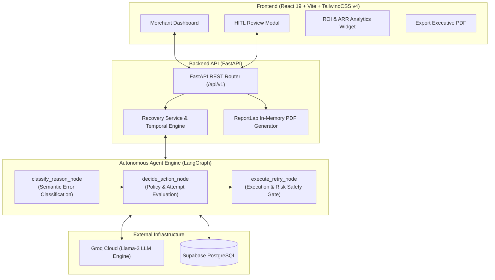

# 🛡️ RecoupAI — Autonomous AI Revenue Recovery Engine

> **Intelligent, Agentic Payment Failure Recovery with Temporal Retries & Human-in-the-Loop Safeguards for Modern Fintech & Subscription Businesses.**

[](https://fastapi.tiangolo.com)
[](https://langchain-ai.github.io/langgraph/)
[](https://groq.com)
[](https://supabase.com)
[](https://react.dev)
[](https://tailwindcss.com)

---

## 📌 Executive Summary & The Problem

In digital subscriptions and recurring commerce, **15%–40% of all customer churn is involuntary**—meaning customers never intended to cancel; their payment simply failed.

Today, businesses handle payment failures in two broken ways:
1. **Passive Acceptance:** Giving up on failed transactions, losing tens of thousands in ARR.
2. **Dumb / Blind Retries:** Hammering card networks with brute-force scripts, causing **₹15–₹25 penalty fees per bounce**, irritating customers, and achieving a meager **~22% industry benchmark recovery rate**.

### 💡 The Solution: RecoupAI
**RecoupAI** replaces dumb retry scripts with an **autonomous LangGraph state machine**. It classifies raw gateway failure telemetry, applies smart temporal retry policies based on transaction physics and salary cycles, executes human-in-the-loop approvals for high-risk payments, and delivers an industry-leading **~75% recovery rate (a 3.2x uplift)** while eliminating unnecessary bounce fees.

---

## 🏛️ System Architecture



---

## 🔄 Multi-Run Resolution & Human-in-the-Loop Lifecycle

| Attempt Phase | Trigger & Failure Archetype | Agent Action & Behavior | Recovery Impact |
| :--- | :--- | :--- | :--- |
| **Run 1: Instant Fixes** | **Bank Timeouts** (`gateway_error`) | Transient network error. Immediately retries. | **~35% Initial Recovery** |
| **Run 2: Temporal Resolution** | **Insufficient Funds** & **Expired Cards** | Waits for salary cycles (1st/5th) & customer update notifications. | **~60% Cumulative Recovery** |
| **Run 3: Stopping Rule** | **Unrecoverable Cards** | Enforces maximum 3-attempt ceiling to stop penalty fees. | **~75% Final Recovery** |
| **Safety Gate: HITL** | **High-Ticket (≥ ₹10k)** or **Fraud Flags** | Pauses into `pending_human_review` for Risk Officer sign-off. | **100% Risk Compliance** |

---

## 📂 Repository Structure

```
.
├── backend/                  # FastAPI + LangGraph + Supabase backend
│   ├── app/
│   │   ├── agents/           # LangGraph StateGraph, nodes, prompts, state
│   │   ├── api/v1/           # REST endpoints (transactions, recovery, metrics)
│   │   ├── db/               # Supabase client & repository pattern
│   │   ├── services/         # Recovery lifecycle, PDF engine, LLM client
│   │   └── main.py           # FastAPI entry point & CORS
│   ├── scripts/              # Seed generator, time simulation, agent CLI tests
│   ├── tests/                # Integration & unit test suite
│   ├── requirements.txt      # Python dependencies
│   └── README.md             # Backend-specific documentation
│
├── frontend/                 # React 19 + TypeScript + Tailwind v4 frontend
│   ├── src/
│   │   ├── api/              # Axios endpoints & API client
│   │   ├── components/       # Dashboard, HITL modal, ROI cards, charts
│   │   ├── pages/            # Dashboard view
│   │   └── types/            # TypeScript data models
│   ├── package.json          # Node dependencies & build scripts
│   └── README.md             # Frontend-specific documentation
│
└── README.md                 # Common project documentation (this file)
```

---

## ⚡ Quick Start & Local Setup

### 1. Clone the Repository
```bash
git clone https://github.com/abhaysingh-22/Razorpay.git
cd Razorpay
```

### 2. Configure Backend
```bash
cd backend
python3 -m venv .venv
source .venv/bin/activate
pip install -r requirements.txt

# Copy and populate environment variables
cp .env.example .env
```
*Required `.env` values in `backend/`:*
```ini
SUPABASE_URL=https://your-project.supabase.co
SUPABASE_KEY=your-supabase-service-role-key
GROQ_API_KEY=gsk_your_groq_api_key
ENV=development
```

Start the backend server:
```bash
uvicorn app.main:app --host 0.0.0.0 --port 8000 --reload
```

### 3. Configure & Launch Frontend
In a new terminal:
```bash
cd frontend
npm install

# Set API URL
echo "VITE_API_URL=http://localhost:8000/api/v1" > .env

# Start Vite dev server
npm run dev
```

Visit the dashboard at **`http://localhost:5173`**!

---

## 📊 Business Metrics & ROI Dashboard

* **Annualized ARR Saved:** Preserves recurring customer Lifetime Value ($/₹) by preventing involuntary churn (`recovered × 12`).
* **Penalty Fees Prevented:** Eliminates bank bounce charges (₹15–₹25 per failed card attempt) using intelligent stopping rules.
* **3.2x Efficiency Uplift:** Outperforms the standard industry ~22% blind retry benchmark by reaching ~75% recovery.
* **Instant Executive PDF:** Single-click generation of stakeholder reports compiled in-memory via ReportLab.

---

## 🧪 Running Tests

```bash
# Run backend integration & unit tests
cd backend
pytest tests/ -v
```

---

## 📄 Documentation Links
- [Backend Documentation](file:///Users/abhaysingh22_/Developer/Razorpay/backend/README.md)
- [Frontend Documentation](file:///Users/abhaysingh22_/Developer/Razorpay/frontend/README.md)
