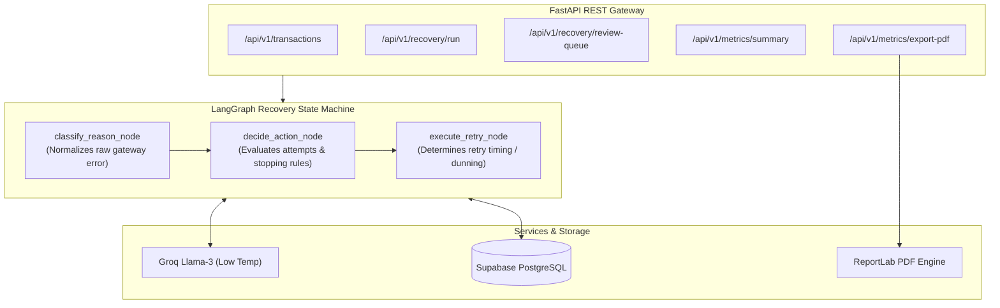

# 🧠 RecoverAI — Backend Service

The core intelligence and recovery orchestration engine for **RecoverAI**. Built with **FastAPI**, **LangGraph StateGraph**, **Groq (Llama-3)**, and **Supabase (PostgreSQL)** to autonomously analyze payment failure telemetry, decide optimal recovery actions, and manage multi-attempt temporal resolution with Human-in-the-Loop safeguards.

---

## 🏗️ Architecture & Core Components



### Key Modules:
- **`app/agents/`**: Contains the compiled `LangGraph` state machine (`graph.py`), state definition (`state.py`), custom prompts, and deterministic execution nodes.
- **`app/services/recovery_service.py`**: Multi-run temporal resolution logic, probability distributions for salary-day recoveries, customer update tracking, and Human-in-the-Loop review resolutions.
- **`app/services/pdf_service.py`**: In-memory byte-stream generation of executive audit reports using ReportLab.
- **`app/db/`**: Supabase repository layers for `transactions`, `recovery_attempts`, and `batch_summaries`.
- **`app/api/v1/`**: Structured REST API endpoints split across `transactions`, `recovery`, and `metrics`.

---

## ⚡ Failure Archetypes & Agent Decision Matrix

| Failure Archetype | Gateway Error Symptoms | Agent Action | Recovery Strategy |
| :--- | :--- | :--- | :--- |
| **Bank Timeout** | `bank_timeout`, `gateway_error` | `retry_scheduled` | Immediate retry (~85% instant recovery on Attempt 1). |
| **Insufficient Funds** | `insufficient_funds`, `low_balance` | `retry_scheduled` | Spaced temporal retry matching salary/deposit cycles (Up to 3 attempts). |
| **Expired Card** | `card_expired`, `invalid_expiry` | `card_update_requested` | Dispatches customer notification; retries once updated. |
| **Fraud Flag** | `fraud_detected`, `risk_threshold` | `flagged_for_human_review` | Auto-retry blocked; routed to Human-in-the-Loop queue. |

---

## 📦 Tech Stack

- **Framework:** FastAPI 0.115.0 & Uvicorn (ASGI)
- **Agent Orchestration:** LangGraph 0.2.45
- **LLM Engine:** Groq API (`openai/gpt-oss-120b` / Llama-3)
- **Database:** Supabase (PostgreSQL) Python SDK
- **Reporting:** ReportLab 4.2.5 (Dynamic in-memory PDF)
- **Testing:** Pytest & HTTPX TestClient

---

## 🚀 Getting Started

### 1. Prerequisites
- Python 3.10+
- Active Supabase project with `transactions`, `recovery_attempts`, and `batch_summaries` tables.
- Groq API Key

### 2. Environment Configuration
Create a `.env` file in the `backend/` directory:
```bash
cp .env.example .env
```

Fill in your credentials:
```ini
# Supabase
SUPABASE_URL=https://your-project.supabase.co
SUPABASE_KEY=your-supabase-service-role-key

# Groq LLM
GROQ_API_KEY=gsk_your_groq_api_key

# Razorpay (Test Mode)
RAZORPAY_KEY_ID=rzp_test_xxxx
RAZORPAY_KEY_SECRET=your_test_secret

# Environment
ENV=development
```

### 3. Installation
```bash
# Create virtual environment
python3 -m venv .venv
source .venv/bin/activate

# Install dependencies
pip install -r requirements.txt
```

### 4. Running the API Server
```bash
uvicorn app.main:app --host 0.0.0.0 --port 8000 --reload
```
API Documentation will be live at:
- Swagger UI: `http://localhost:8000/docs`
- Redoc: `http://localhost:8000/redoc`

---

## 🛠️ CLI Utilities & Scripts

The `scripts/` folder contains useful tools for local development, seed generation, and clock simulation:

```bash
# 1. Seed database with synthetic failed transactions
python -m scripts.seed_db --count 25

# 2. Time travel simulation (shifts retry schedule backwards to trigger queue)
python -m scripts.simulate_time_passing --hours 24

# 3. Test agent node execution independently in CLI
python -m scripts.test_agent_node
```

---

## 📡 API Reference

### 💳 Transactions
- `POST /api/v1/transactions/generate?count=10` — Injects realistic synthetic failed payment scenarios.
- `GET /api/v1/transactions/` — Lists all transactions with filters.
- `GET /api/v1/transactions/{id}` — Returns transaction details and complete recovery attempt audit history.
- `POST /api/v1/transactions/reset` — Resets demo database state.

### ⚡ Recovery Pipeline
- `POST /api/v1/recovery/run` — Executes an agentic recovery batch across due transactions.
- `GET /api/v1/recovery/review-queue` — Lists transactions paused for Human-in-the-Loop review.
- `POST /api/v1/recovery/review-queue/{id}/resolve` — Resolves review (`approve` or `escalate`).
- `GET /api/v1/recovery/attempts` — Fetches complete historical audit trail of agent decisions.

### 📊 Analytics & Reporting
- `GET /api/v1/metrics/summary` — Returns current recovery rate, total amount at risk, and ROI metrics.
- `GET /api/v1/metrics/history` — Returns recovery performance over time across batch runs.
- `GET /api/v1/metrics/export-pdf` — Downloads an executive PDF recovery report.

---

## 🧪 Testing

Run unit and end-to-end integration tests:
```bash
pytest tests/ -v
```
